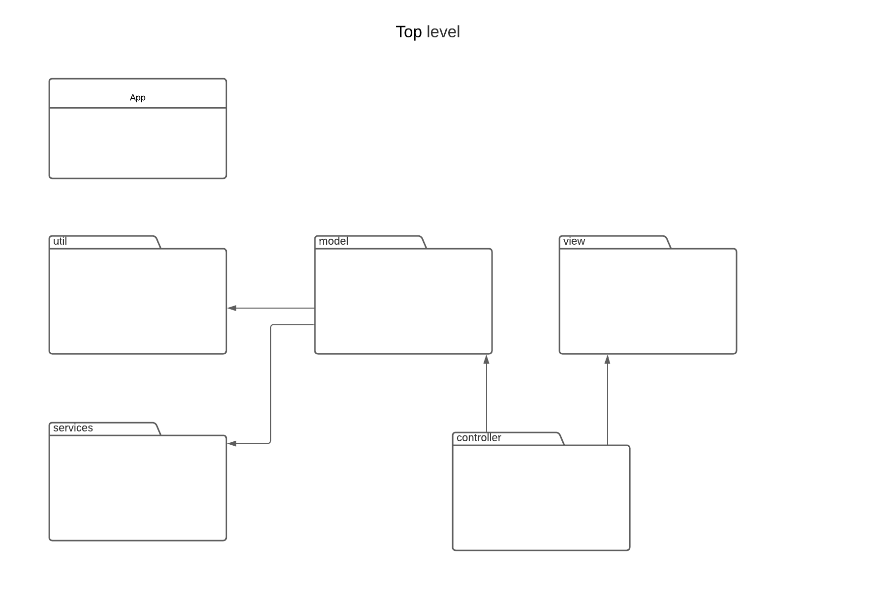
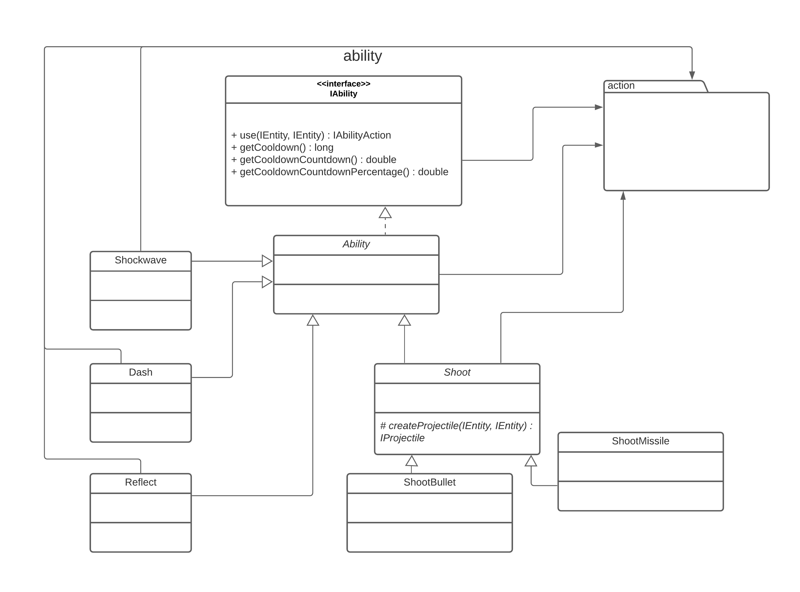
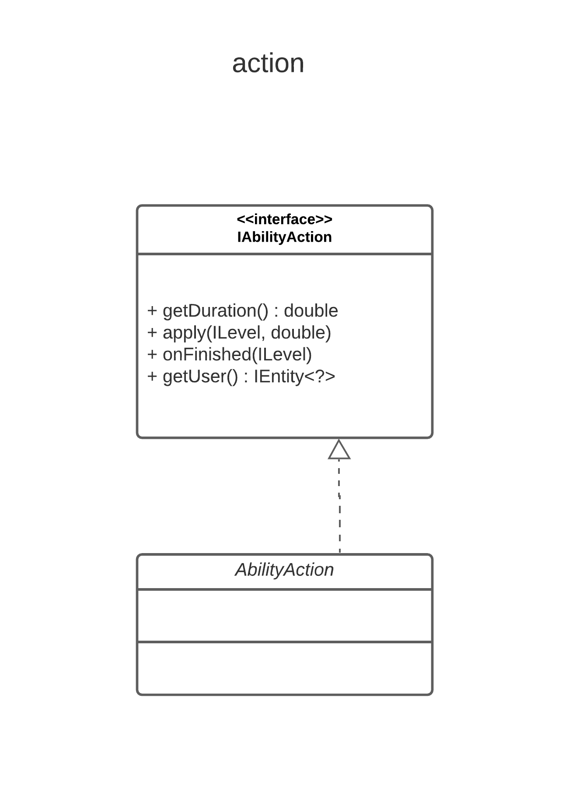
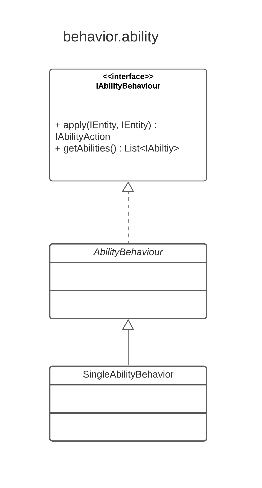
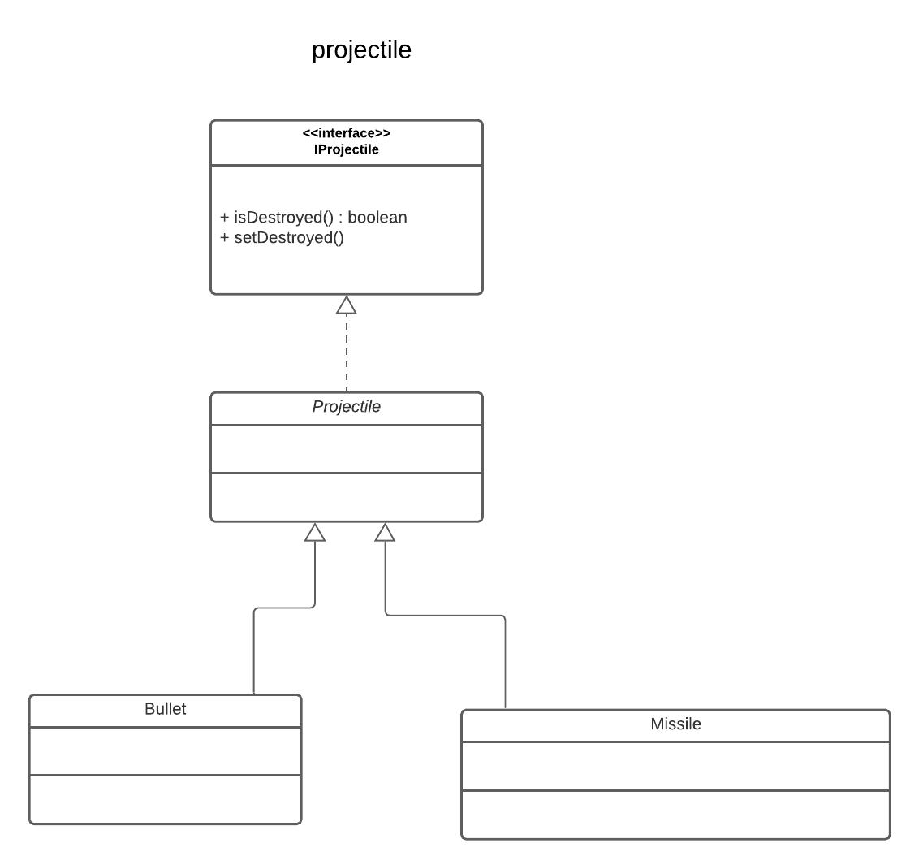

# System Design Document for Pointy

**Authors:** Anton Hildingsson, Erik Magnusson, Joachim Ørfeldt Pedersen, Mattias Oom, Simon Genne

**Version:** 1.0

**Date:** 2020-10-23

## 1. Introduction

Jerk Evert is a topdown 2D game. The player is a simple geometrical shape that navigates a hostile, equally geometrical, world. In this world, the player is attacked by various enemies that shoot different kinds of projectiles at the player. The player itself has no weapon, but instead a set of abilities which (with some creativity) can be used to defeat the enemies. A few of these abilities are "reflection" (reflecting enemy projectiles), "shockwave" (pushing enemies away) and "dash" (making the player invulnerable and very fast for a short period).

The map contains different neutral elements, such as walls and moving walls, which can trap the player, but also be used as cover.

The goal of the player is to defeat all enemies. The game contains multiple levels, and by defeating one level, the player can progress to the next.

### 1.1. Definitions, acronyms, abbreviations

- 2D - Two dimensional
- Topdown game - A game that is viewed from above.
- Projectile - Object fired by some entity towards some other entity. Can cause harm to the player or enemies.
- Obstacle - Neutral object placed on the level. Some obstacles may hinder the movement of the player, enemies, and projectiles in the game.
- Ability - Can be used by the player or enemies to impact the flow of the game in some way. This can, for example, be by adding a projectile to the game, or by directly impacting the surrounding entities in some way.
- Player - Entity controlled by the user of the Game. 
- Enemies - Opponents of the player. Will use their abilities to try to defeat the player. 
	   

## 2. System architecture
The general architecture of the application is rather simple. No external servers or databases used -- the game is all run locally on the machine of the user. 

OpenJFX is used for the graphical end of the game, reading keyboard input, and handling sound. OpenJFX also manages the runnable application itself, which means a JavaFX `Application` class is created to launch the game.

Persistent data storage is all handled locally by an external JSON-parser. More can be read below (4. Persistent Data Storage). 

When the application starts, the JavaFX Application loads a game window controller and initializes the `MainWindow` (the container for all graphical elements). This game window controller then creates a new `Game` object, a game loop, and launches the game. At this point, the first level is read from disk. When the player completes a level, the next level is read from disk in the same way.

The player is prompted by a menu that controls the level settings, the starting and stopping of the game itself, and displaying the score and other progress indicators. When the player starts the game, it will run until they stop it themselves, or until the game is finished.

## 3. System Design

The controller package interacts with the view by letting `GameWindowController` store a `Renderer` object that can be used to draw to the screen. It also has an `IGame` attribute, that will refer to the instance of `Game` used to run the game, through which it can interact with the gameplay. `GameWindowController` also creates a game loop, in which the renderer will be used to draw the current state of the game to the screen. In the loop, a call will be made to the model telling it to update its state.

Both the `Model` and `View` packages make use of the functions implemented in the util package to affect vectors.

As of now, the MVC implementation is not typical. The controller (in this case, the `GameWindowController`) has access to both the view and the model. The relationship between the view and the model is limited. Most rendering is done by letting the controller pass part of the model to the renderer as the argument in a method call. However, the `GameWindowController` also registers the renderer as a `AbilityActionEventListener` for `IAbilityActionEvents` which are sent by `Game` when any entity activates an ability. This is used by the renderer to know when and how to draw certain visual effects.

Being that the view doesn't interact with the model in any way, we believe that we have managed to achieve a version of MVC that is better than the typical one since we reach a higher level of decoupling than we otherwise would have.  

The `GameWindowController` also links `Game` with a `KeyboardInputController` which applies different actions depending on which keyboard keys are pressed, and a `MouseInputController` which does the same, but for mouse actions.

Here follows a set of diagrams over all our packages. We have decided to leave the fields containing lists of objects in the package diagrams, since the package diagrams otherwise cannot show the relationship between packages. However, we have left out these fields in the design model. Instead, these fields are represented by multiplicities. 

|                                                                                                                                                                                                  |                                                                                                                     |
| ------------------------------------------------------------------------------------------------------------------------------------------------------------------------------------------------ | ------------------------------------------------------------------------------------------------------------------- | 
|                                                                             |  |
| GameWindowController creates a game loop, during which, it will use the Keyboard- and MouseInputHandler to gather input from the user and apply these to the model.                              | GameLoop implements the template of the game loop that will be used by GameWindowController.                        |
|                                                                                  |   |
|Game is what connects the different parts of the model. It will update the state of all the entities during the gameplay, according to interactions between them and inputs from the outside.     | Abilities can be used by the player and enemies during gameplay to impact other entities.|
|                                                                                 | |
|AbilityActions are created by Abilites to apply their desired affects onto the game.                                                                                                              | Behaviours control the actions of enemies.                                                                                                                                                         |
|                                                                       | |
|AbilityBehaviours control how an enemy uses its abilities.                                                                                                                                        | MovementBehaviours control the movement of an enemy.                                                                                                                                                                        |
|                                                                                | |
|Entities represent all active objects in the game, such as players, enemies, obstacles, projectiles, and so on.                                                                                   | Enemies are the opponents of the player. Acts according to its behaviours. Different enemy types are achieved through different combinations of behaviours.                                                                                                                            |
|                                                                                | |
|MovableEntity represents something that can move. Implements the movement functionality for all movable entities in the game.                                                                     | Neutral elements that can hinder the movement of other entities and/or cause damage to them. |
|                                                                                 | |
|Player represents the entity controlled by the player of the game.                                                                                                                                | Projectiles can be fired by some enemies and cause damage to certain entities. Bullets will get a velocity when created, which will remain until they are destroyed. Missiles will change their velocities according to the movement of their targets. |
|                                                                                  | |
|A Level stores the contents of a playable level, together with information about width and height of the map.                                                                                     | Shape2D represents the shape of an entity. It stores methods relevant for rendering and collision checking.     |
|                                                                               | |
|LevelLoader creates levels from JSON-files that specify the contents of the level. EntityFactory creates entities of different sorts.                                                             | Utils contains helper methods for handling vectors. Shapes contains methods for manipulating shapes. |
|                                                                                   ||
|Renderer uses RenderUtils to draw entities to the screen.                                                                                                                                         ||

**Design model:**

**Domain model:**

### 3.1 Relation between domain model and design model

In the domain model, The `Game` class is said to run the `Level` which contains a player, enemies, obstacles, and projectiles. This is reflected in the design model, where `Game` has a reference to an `ILevel` (currentLevel) and a list of `ILevels` (levels). `Level` holds references to the enemies, obstacles, player, and projectiles, that are to be shown while on the level that is represented by that object. `Game` will, during gameplay, access these and update them according to the state of the game and input from the user. 

The domain model shows `Enemy` to have two behaviours. In the design model, this is the case since `Enemy` has a reference to an `IAbilityBehaviour` and an `IMovementBehaviour`. These will dictate what actions are carried out by the enemy.

Both the `Player` and `Behaviour` in the domain model have references to `Ability`. In the design model, `Player` has a reference to one to three `IAbilties`. These abilities will be used by the player during the gameplay to affect the environment/state of the player in some way. The multiplicity of behaviours related to `Ability` is 0..* in the domain model. In the design model, some behaviours will have no knowledge of abilities (movementBehaviours), while some will be able to hold many (abilityBehaviours). 

The `Ability` in the domain model creates 0..* projectiles. In the design model, some concrete ability classes have references to projectiles. These abilities are supposed to create projectiles and add them to the level. Other abilities have no knowledge of projectiles at all.

### 3.2 Implemented design patterns
* MVC (Model View Controller) for separating game logic, user input, and graphical interface.
* Factory (method) pattern for simplifying the creation of game entities such as players and enemies
* Command pattern, which is used for executing actions when a key is pressed.
* Composite pattern, allowing players and enemies to have different abilities and behaviours. The construction of these entities is simplified using the factory pattern.
* Template method pattern, letting Ability implement a method that is dependent on an abstract method implemented by subclasses.
* Visitor pattern, shapes accept a visitor to do specific action for different shapes
* Observer pattern, the view listens for ability action events sent by the game. This is used to indicate when to draw certain effects to the screen.

## 4. Persistent data management

The application makes use of JSON to handle level data. The level files contain JSON objects pertaining to the information of the level and its entities, i.e. their type (player, enemy, obstacle), variants (e.g. type of enemy) as well as instance variables not handled by the factory. Levels are loaded through the class `LevelLoader` which parses the JSON file corresponding to a certain level ID, creates an object of type `Level`, and returns this object to be used by the `Game` class. Each level is contained within a separate file and is only loaded when needed to save memory resources. The parsing is done using the GSON library. 

Top scores for each level are saved in a text file which is handled by class `HighscoreHandler`. 

## 5. Quality

The application is tested using unit tests with the framework JUnit. These tests can be found under project/src/main/test. 

The overall code coverage of the application is 45%. The coverage of the model, however, is higher at 82%.  

Continuous Integration is done using Travis to automatically run tests when doing pull requests to ensure nothing merged to master causes tests to fail. 

Link to Travis for our project: https://travis-ci.com/github/feldtsen/pointy-dit212

The game has also been thoroughly game tested by playing the different levels and manually testing the functionality described by the different user stories.

## 6. References
- JavaFX - https://openjfx.io/
- JUnit  - https://junit.org/
- Maven  - https://maven.apache.org/
- Travis - https://travis-ci.com